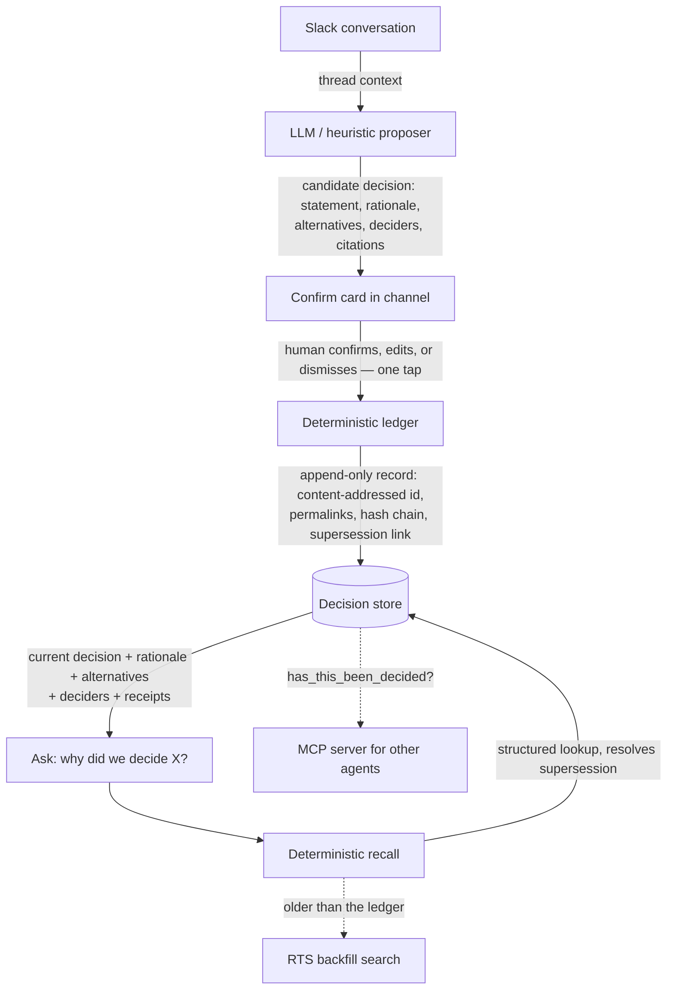

<div align="center">

# Precedent

**The decision memory your team — and its agents — can trust.**

Precedent records what your team decided, *why*, and what it *rejected* — grounded in links to the exact source messages. When a decision is later overturned, Precedent knows, so recall always returns the current call and can walk the history. And any agent in the workspace can ask `has_this_been_decided()` before it acts.

[](LICENSE)
[](.nvmrc)
[](tsconfig.base.json)
[](#tests)
[](https://docs.slack.dev/ai/slack-mcp-server/)

</div>

---

## The problem

Teams make their most important decisions in conversation, and conversation forgets. Someone writes *"ok, we're dropping the Redis cache, it's not worth the operational load,"* three people react 👍, and the thread scrolls away. Six weeks later a new contributor opens a PR **adding a Redis cache.** Nobody remembers why it was rejected. The people who were in the room have moved on.

Search doesn't fix this. Search retrieves messages that *mention* a topic. It has no idea a decision was ever made, can't tell *"we're leaning Postgres"* from *"decided, Postgres,"* doesn't know what was rejected, and will hand you a decision that was reversed three months ago with total confidence. A chat log tells you what was *said*. **Precedent tells you what was *decided* — and whether it's still true.**

## What makes it more than a search box

Four things separate Precedent from anything a search API can do. Each is stated precisely — these are not new *concepts* (rationale capture and ADR "superseded-by" links are decades old), but no shipping product does the **combination**, automatically, from ambient Slack chat, callable by other agents:

1. **Decision detection** — it captures the moment a *commitment* is made, not every message that mentions the subject.
2. **Captured alternatives** — it records what was considered and *rejected*, and why. The rejected options are what stop a team from reopening a settled question.
3. **Supersession tracking** — when a later decision overturns an earlier one, the ledger links them. Recall resolves to the current head and can show the chain. *This is the demo moment search can never do.*
4. **Provenance by construction** — every record links to the exact source messages. The answer is grounded in real permalinks, so it physically cannot invent a rationale.

> **The one-line version:** a chat log tells you what was said; Precedent tells you what was decided, and whether it's still true.

## The move that elevates it: a memory layer for other agents

Precedent exposes its ledger as **its own MCP server**. Any agent in the workspace can call `has_this_been_decided("auth provider")` and get back the **current** decision (supersession already resolved), its history, and the source permalinks — *before it acts*. That changes the category from "an agent" to "the memory layer other agents consult."

```text
$ (an agent, mid-task) → has_this_been_decided("primary datastore")
{
  "decided": true,
  "current":  { "statement": "Use SQLite (libSQL) as the primary datastore", "status": "confirmed", ... },
  "wasSuperseded": true,
  "history": [ "Use Postgres as the primary datastore", "Use SQLite (libSQL) as the primary datastore" ]
}
```

*(This exact round-trip is verified end-to-end against a live MCP client — see [Tests](#tests).)*

## Architecture

The spine is a **hard boundary between a language model that *proposes* and a deterministic engine that *owns the truth*.** The model is allowed to be fuzzy, because everything it produces is a proposal a human confirms; the deterministic layer is never allowed to guess, because it is the part that has to be trustworthy. This boundary is why Precedent physically cannot hallucinate a decision into existence.



Read the full design in **[docs/architecture.md](docs/architecture.md)**.

## Monorepo layout

A strict dependency direction enforces the architecture: **`ledger-core` has zero dependencies on Slack, the LLM, or HTTP.** It is the deterministic, well-tested heart; everything else depends on it.

| Package | Responsibility | Depends on |
|---|---|---|
| [`packages/ledger-core`](packages/ledger-core) | Append-only ledger, content-addressed IDs, hash-chain integrity, supersession resolution. **Zero runtime deps.** | — |
| [`packages/proposer`](packages/proposer) | The model layer: heuristic decision detector, provider-agnostic LLM port, deterministic recall, RTS backfill port. | ledger-core |
| [`packages/mcp-server`](packages/mcp-server) | Precedent's own MCP server: `has_this_been_decided`, `get_decision`, `list_decisions`. | ledger-core, proposer |
| [`packages/slack-app`](packages/slack-app) | Bolt surface: the Block Kit proposal card and `/precedent` recall. | ledger-core, proposer |
| [`apps/server`](apps/server) | Composition root — one process serving Slack (Socket Mode) + MCP (`/mcp`). | all of the above |

## Quickstart

```bash
nvm use                 # Node >= 20 (see .nvmrc)
npm install
npm test                # 26 tests across all packages
npm run typecheck       # strict TypeScript, whole workspace

cp .env.example .env    # then fill in your Slack sandbox tokens
npm start               # Slack app (Socket Mode) + MCP server on :3010/mcp
```

The built-in `HeuristicDetector` needs **no** API key — it detects decisions from explicit commitment cues and favors precision, since a human confirms every proposal. Plug in the `LlmDetector` for richer extraction.

### Connecting to Slack

1. Create an app at [api.slack.com/apps](https://api.slack.com/apps) → **From a manifest**, and paste [`manifest.json`](manifest.json).
2. Install it to your **Slack developer sandbox** (join the [Slack Developer Program](https://api.slack.com/developer-program) to provision one).
3. Copy the bot, app-level, and signing tokens into `.env`.

> **Note on the Real-Time Search API & MCP server** (both GA since 2026‑02‑17): semantic recall requires a **Slack AI–enabled** workspace, and both surfaces require an **internal or directory-published** app (unlisted apps are blocked). Precedent's recall runs against the deterministic ledger regardless; RTS is the backfill path for decisions older than the ledger. See [docs/research/hackathon.md](docs/research/hackathon.md).

## <a id="tests"></a>Tests & verification

```
✓ packages/ledger-core   — append/dedup, supersession chains, reversal, hash-chain tamper detection (13)
✓ packages/proposer      — precision-first detection, deterministic recall (4)
✓ packages/mcp-server    — has_this_been_decided / get_decision / list_decisions (4)
✓ packages/slack-app     — Block Kit proposal card + recall answer (3)
✓ apps/server            — seeded demo history is verifiable and correctly resolves supersession (2)

Test Files  7 passed (7)   Tests  26 passed (26)
```

The MCP path is additionally verified **at runtime**: a live MCP client connects to the server, lists the tools, and calls `has_this_been_decided`, which returns the current decision with the reversal correctly resolved.

## Where Precedent sits

Being honest about what exists is what keeps this from being dismissed on novelty. The full, source-verified map is in **[docs/research/competitive-landscape.md](docs/research/competitive-landscape.md)**; the short version:

| | Ambient detect (from chat) | Rejected alternatives | Auto, linked supersession | Permalink provenance | Agent-callable (MCP) |
|---|:---:|:---:|:---:|:---:|:---:|
| **Precedent** | ✅ | ✅ | ✅ | ✅ | ✅ |
| Decision Tracker (Slack) | ⚠️ rule-based | ❌ | ❌ | ⚠️ | ❌ |
| Decision Desk / Loqbooq (Slack) | ❌ manual | ❌ | ❌ | ⚠️ | ❌ |
| ADR / MADR (markdown) | ❌ manual | ✅ manual | ⚠️ manual link | ❌ | ❌ |
| Meeting assistants (Fellow, Otter…) | ❌ meetings only | ❌ | ❌ | ❌ | ❌ |
| Slack AI / Glean / Dust | ❌ search/RAG | ❌ | ❌ | ✅ | ⚠️ |
| Hyper (YC) | ⚠️ ingests all | ❌ | ⚠️ staleness | ✅ | ✅ |

The whitespace is the specific combination: **automatic, supersession-aware capture of decisions as first-class objects, from ambient Slack chat, grounded in permalinks, callable by other agents.** Precedent's edge over horizontal "memory" tools (Hyper et al.) is *focus and auditability* — a citable decision of record an agent can trust and a human can defend, not an "everything" blob.

## Impact — built for community continuity

Precedent is aimed first at the teams that feel this pain most sharply and can least afford existing tools: **under-resourced nonprofits, NGOs, and volunteer-led open-source communities**, where constant turnover destroys institutional memory. When the reasoning behind decisions is preserved and legible, newcomers can participate as peers instead of relitigating settled questions, maintainers stop paying the burnout tax of re-explaining the same calls, and a project keeps its coherence even as volunteers cycle through. Preserving the *why* is a real lowering of the barrier to entry — an inclusion and continuity win, not a hand-wave. The same engine is how any organization stops losing its memory to turnover.

## Roadmap

**MVP (this build):** capture with confirm, recall with supersession, permalink provenance, one Block Kit surface, an MCP server, and a seeded demo workspace. → **v1:** persistent store, RTS backfill wizard, weekly digest, GitHub links, export. → **Beyond:** cross-agent precedent gate, enterprise governance (approvals, retention, audit export), analytics (reversal rate, most-relitigated topics). Full detail in **[docs/roadmap.md](docs/roadmap.md)**.

## Status

Built for the **[Slack Agent Builder Challenge](https://slackhack.devpost.com/)** — *Slack Agent for Good* track. Submission deadline **July 13, 2026, 5:00 PM PDT**.

## License

[Apache-2.0](LICENSE) © The Precedent Authors. See [NOTICE](NOTICE).
