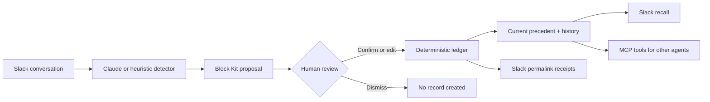
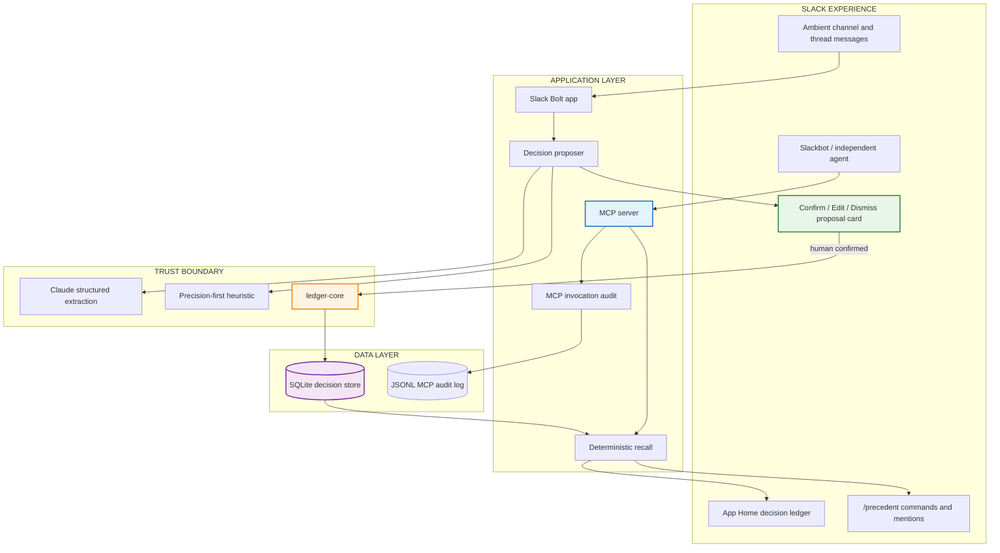
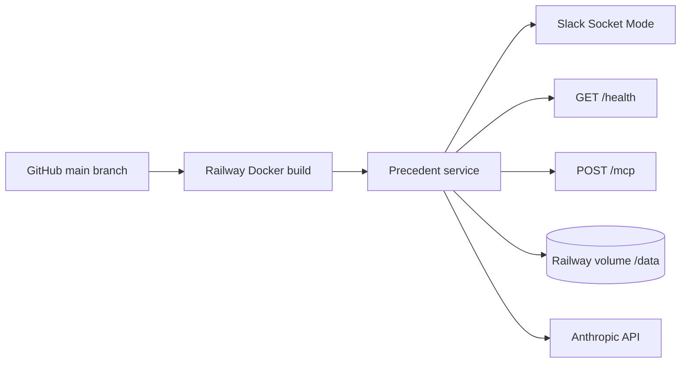
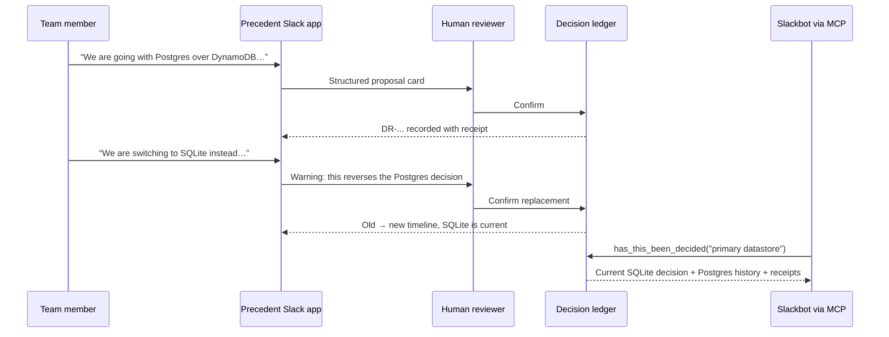

# Precedent — Decision Memory for Slack and Its Agents

[](https://nodejs.org/)
[](https://www.typescriptlang.org/)
[](https://api.slack.com/)
[](https://railway.com/)
[](#reproducible-testing)
[](LICENSE)

> **A chat log tells you what was said. Precedent tells you what was decided — and whether it is still true.**

Precedent is an ambient decision-memory agent for Slack. It detects commitments in conversation, asks a human to confirm the record, preserves the rationale and rejected alternatives, and links later reversals into a complete decision history. Every answer includes real Slack source receipts.

Precedent also exposes that same authoritative ledger through its own MCP server, so Slackbot and other agents can check team precedent before proposing work.

## Quick Highlights

- **Ambient Decision Capture** — detects explicit commitments in Slack without making users fill out a separate form
- **Human-Owned Truth** — the model proposes; a person confirms, edits, or dismisses before anything enters the ledger
- **Reversal Awareness** — resolves old → new decision chains and makes “this reverses decision X” visually prominent
- **Rejected Alternatives** — preserves what the team ruled out and why, preventing expensive relitigation
- **Source Receipts** — every record links to the exact Slack messages that grounded it
- **Agent-Callable Memory** — Slackbot and independent agents query the same ledger through MCP
- **Deterministic Ledger** — append-only records, content-addressed IDs, hash-chain integrity, and supersession validation
- **Production Deployment** — one Railway service runs Slack Socket Mode, the health endpoint, and the MCP endpoint with durable SQLite storage

## Live Deployment

| Surface | URL | Access |
|---|---|---|
| **Service** | https://precedent-production-33a7.up.railway.app | Public host |
| **Health check** | https://precedent-production-33a7.up.railway.app/health | Public |
| **MCP server** | https://precedent-production-33a7.up.railway.app/mcp | Bearer token or signed Slack request |
| **Primary interface** | Slack app | Installed workspace members |

The service runs on Railway with a persistent volume mounted at `/data`. Slack interactions use Socket Mode, while HTTP serves health checks and authenticated MCP traffic.

## Architecture Overview

### High-Level Workflow



### System Architecture



### Railway Runtime



The central design rule is simple: **the language model may propose, but only deterministic code and a human confirmation can establish truth.** An unconfirmed model output never becomes organizational memory.

### Tech Stack

| Layer | Technology | Purpose |
|---|---|---|
| **Slack surface** | Bolt for JavaScript + Block Kit | Ambient capture, review cards, Home tab, commands, mentions |
| **Language** | TypeScript 5 in strict mode | Shared contracts across the monorepo |
| **Model layer** | Anthropic Claude | Structured decision extraction and richer rationale capture |
| **Fallback detector** | Deterministic heuristic | No-key, precision-first local operation |
| **Agent protocol** | Model Context Protocol | Authoritative decision tools for other agents |
| **Ledger** | Custom deterministic core | IDs, validation, deduplication, provenance, supersession |
| **Storage** | SQLite via `node:sqlite` | Durable append-only decision records |
| **Testing** | Vitest | Unit, integration, rendering, persistence, and MCP coverage |
| **Runtime** | Node.js 22 + `tsx` | Single-process Slack and MCP service |
| **Deployment** | Docker + Railway | Production runtime, health checks, persistent volume |

## The Problem

Important decisions disappear inside chat. A volunteer maintainer explains why Postgres was rejected, leaves the project, and a new contributor later proposes Postgres again. Slack search returns both the old Postgres message and the newer SQLite message, but it does not understand that one replaced the other.

This creates three costs:

- maintainers repeatedly explain the same history
- new contributors lack equal access to context held by long-tenured members
- agents confidently act on stale messages because search does not model decision state

Search finds mentions. **Organizational memory must resolve authority, history, and provenance.**

## The Solution

Precedent turns conversational commitments into confirmed, citable decision records:

1. A team member states a decision in Slack.
2. Precedent detects the commitment and shows a structured proposal card.
3. A human confirms, edits, or dismisses it.
4. The ledger stores the decision, rationale, alternatives, deciders, timestamp, and source permalinks.
5. If a later message changes the call, Precedent links the new record to the decision it replaces.
6. Slack users and MCP-connected agents receive the current decision plus the complete history.

The result is not another search bot. It is a small, auditable system of record for team decisions.

## Decision Lifecycle



## Features

### Ambient Capture and Human Review

- Listens for decision-shaped Slack messages rather than generic topic mentions
- Extracts a statement, rationale, rejected alternatives, scope, deciders, and citations
- Shows a native Block Kit proposal with **Confirm**, **Edit**, and **Dismiss** actions
- Never writes an unconfirmed proposal into the authoritative ledger

### Reversal-Aware Recall

- Suggests the prior record when a new proposal touches an existing scope
- Uses a decision selector instead of requiring pasted record IDs
- Makes reversals prominent before confirmation
- Returns one compact old → new timeline with real names and timestamps
- Resolves the current head deterministically even when older messages rank highly in search

### Slack-Native Product Surface

- App Home provides onboarding and a permission-filtered decision ledger
- `/precedent onboard` explains the product inside Slack
- `/precedent why <topic>` and app mentions recall current precedent
- Error messages include a next action instead of dead-ending the user
- All displayed evidence points back to genuine Slack permalinks

### MCP Decision Memory

Precedent exposes three tools:

| Tool | Purpose |
|---|---|
| `has_this_been_decided` | Checks a topic and returns the current decision, history, and receipts |
| `get_decision` | Retrieves a specific decision by ID |
| `list_decisions` | Lists the decision ledger available to the caller |

Every invocation is written to a structured audit log for production debugging and demo verification.

### Deterministic Trust Controls

- Content-addressed `DR-...` identifiers
- Append-only persistence with database immutability triggers
- Hash-chain and provenance tamper detection
- Duplicate suppression
- Forked-supersession rejection
- Workspace and channel-aware access filtering
- Bearer authentication for external MCP clients and Slack signature verification for Slack calls

## Quick Start

### Prerequisites

- Node.js 22+
- npm
- A Slack app created from [`manifest.json`](manifest.json)
- Slack bot token, app-level Socket Mode token, and signing secret
- Optional Anthropic API key for Claude-backed extraction

### Installation

```bash
git clone https://github.com/ankitlade12/precedent.git
cd precedent
nvm use
npm install

cp .env.example .env
# Add your Slack credentials and generate a strong MCP_BEARER_TOKEN.

npm start
```

By default, the server exposes MCP at `http://localhost:3010/mcp`. Without an Anthropic key, Precedent automatically uses its built-in precision-first heuristic detector.

### Connect the Slack App

1. Open [api.slack.com/apps](https://api.slack.com/apps).
2. Choose **Create New App → From an app manifest**.
3. Paste [`manifest.json`](manifest.json).
4. Install the app to your Slack workspace.
5. Copy the bot token, app-level token, and signing secret into `.env`.
6. Start Precedent. In each public test channel, run `/precedent onboard` once; in a private channel, run `/invite @Precedent` first.

### Usage

1. Run `/precedent onboard` in a public channel to activate ambient capture. For a private channel, invite the app first with `/invite @Precedent`.
2. Post an explicit commitment such as: `We are going with Postgres over DynamoDB because relational integrity matters.`
3. Review and confirm the Precedent proposal card.
4. If the message was posted before activation, run `/precedent log` to recover it.
5. Post a reversal: `We are switching to SQLite because a volunteer team should not carry the infrastructure burden.`
6. Confirm the reversal and inspect the current-decision timeline.
7. Ask Slackbot: `Before I propose moving back to Postgres, use Precedent to check the complete history.`

## Reproducible Testing

```bash
# Full test suite
npm test

# Strict TypeScript verification
npm run typecheck

# Detection evaluation
npm run eval

# Core ledger only
npm run test:core

# Production health check
curl https://precedent-production-33a7.up.railway.app/health
```

Current verified result:

```text
Test Files  14 passed (14)
Tests       60 passed (60)
```

Coverage includes ledger deduplication, supersession, reversals, tamper detection, SQLite restart persistence, Claude proposal mapping, Slack Block Kit rendering, relitigation warnings, onboarding, MCP tools, production configuration, and invocation auditing.

The labeled detector evaluation scores the no-key heuristic at **100% precision / 71% recall / 83% F1**. With the configured Claude detector, the same set scores **100% / 100% / 100%**.

## Project Structure

```text
precedent/
├── apps/
│   └── server/                 # Composition root: Slack + MCP + health endpoint
├── packages/
│   ├── ledger-core/            # Deterministic decision model and supersession logic
│   ├── store-sqlite/           # Durable append-only SQLite adapter
│   ├── proposer/               # Detection, recall, RTS port, evaluation harness
│   ├── llm-anthropic/          # Claude structured extraction adapter
│   ├── mcp-server/             # MCP tools, authentication, invocation auditing
│   └── slack-app/              # Bolt handlers, Block Kit, Home, commands, mentions
├── data/                       # Local runtime data; ignored by Git
├── manifest.json               # Slack app manifest
├── Dockerfile                  # Production image
├── railway.toml                # Railway build, health, and restart policy
├── .env.example                # Safe configuration template
├── package.json                # Workspace scripts and Node version contract
└── tsconfig.json               # Strict monorepo TypeScript configuration
```

## Configuration

```bash
# Slack
SLACK_BOT_TOKEN=xoxb-...
SLACK_APP_TOKEN=xapp-...
SLACK_SIGNING_SECRET=...
SLACK_USER_TOKEN=              # Optional RTS private-search token

# Precedent MCP
MCP_PORT=3010
MCP_PATH=/mcp
MCP_AUDIT_PATH=data/mcp-audit.jsonl
MCP_BEARER_TOKEN=              # Required for a shared endpoint

# Detection
PRECEDENT_DETECTOR=            # Set to heuristic to force no-LLM mode
ANTHROPIC_API_KEY=             # Optional
ANTHROPIC_MODEL=claude-opus-4-8
```

Never commit `.env`. Production secrets belong in the deployment platform's encrypted variable store.

## Deploying to Railway

The repository includes a Dockerfile and `railway.toml`, so Railway can deploy directly from `main`.

1. Create a Railway project and connect this GitHub repository.
2. Add a persistent volume mounted at `/data`.
3. Add the Slack, MCP, and optional Anthropic variables from `.env.example`.
4. Generate a public Railway domain.
5. Deploy and verify `/health`.
6. Configure the public `https://<domain>/mcp` URL in Slack's MCP Server settings.

`railway.toml` configures the Dockerfile builder, `/health` deployment check, and restart-on-failure policy. Railway supplies `PORT`; Precedent honors it in managed environments.

## Why Precedent Is Different

| Capability | Slack search / RAG | Manual ADRs | Precedent |
|---|:---:|:---:|:---:|
| Detects decisions from ambient chat | ❌ | ❌ | ✅ |
| Requires human confirmation | — | ✅ | ✅ |
| Stores rationale and rejected alternatives | ❌ | ✅ | ✅ |
| Automatically links reversals | ❌ | ⚠️ manual | ✅ |
| Resolves the current decision | ❌ | ⚠️ manual | ✅ |
| Links to original Slack receipts | ✅ | ❌ | ✅ |
| Callable by independent agents through MCP | ⚠️ | ❌ | ✅ |
| Audits agent lookups | ❌ | ❌ | ✅ |

The novelty is the combination: **ambient capture + human confirmation + deterministic supersession + source provenance + agent-callable access.** That combination turns scattered Slack conversation into organizational memory another agent can safely consult.

## Built for Community Continuity

Precedent is designed for nonprofits, NGOs, and volunteer-led open-source communities where turnover destroys context fastest and re-explanation time is most expensive. A contributor who was not present for the original discussion should still have equal access to:

- the current decision
- the reasoning behind it
- the alternatives already tried or rejected
- the people and timestamps involved
- the original evidence

The measurable goal is fewer reopened decisions, less maintainer re-explanation, faster contributor onboarding, and fewer abandoned contributions.

## Future Enhancements

- RTS backfill for decisions made before Precedent was installed
- Weekly decision digests
- GitHub issue and pull-request receipts
- ADR export
- Multi-workspace tenancy
- Configurable retention and governance controls
- Decision analytics for repeated relitigation and onboarding friction

## License

[MIT](LICENSE) © 2026 Ankit Hemant Lade and Precedent contributors.

---

**Built for the Slack Agent Builder Challenge — Slack Agent for Good.**

*Precedent gives every teammate and every agent access to the decisions that still govern the work.*
