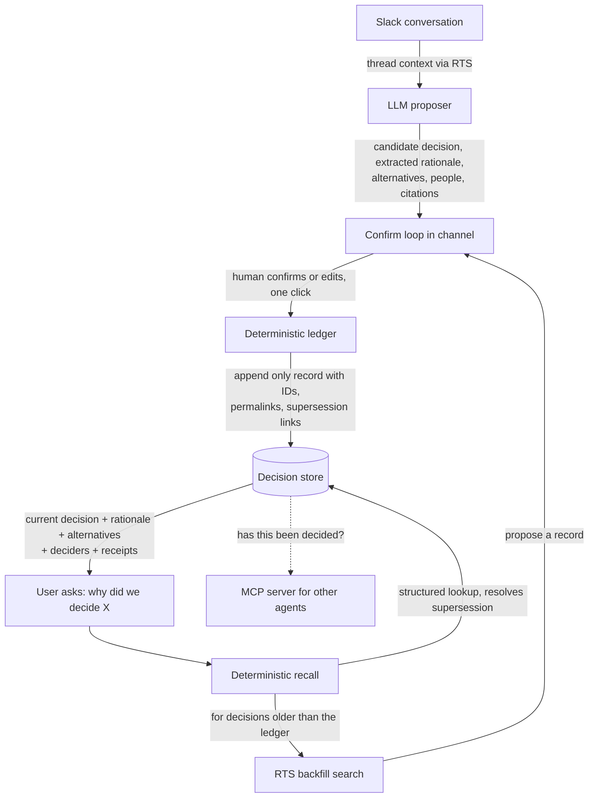

# Precedent

**An ambient decision ledger for Slack. It remembers what your team decided, why, what you rejected, and when a call gets overturned, so nobody has to relitigate a settled question ever again.**

| | |
|---|---|
| **Category** | Decision memory and provenance for conversational work |
| **Surface** | Slack agent, built on the Real-Time Search API and the Slack MCP server |
| **Hackathon** | Slack Agent Builder Challenge, Slack Agent for Good track |
| **Deadline** | July 13, 2026, 5:00pm PDT |
| **Status** | Scope locked. Community and open source framing chosen. Build starting. |
| **Not a side project** | Community version is the wedge. The same ledger is the enterprise product the day after. |

---

## 1. The problem

Teams make their most important decisions in conversation, and conversation forgets. Someone writes "ok, we are dropping the Redis cache, it is not worth the operational load," three people react with a thumbs up, and the thread scrolls away. Six weeks later a new contributor opens a pull request adding a Redis cache. Nobody remembers why it was rejected. The people who were in the room have moved on or moved teams. So the team relitigates a question they already answered, or worse, quietly reverses a good decision because the reasoning evaporated.

This is not a minor annoyance. It is a tax that compounds. Every reversed decision, every rehashed debate, every "wait, why did we do it this way" is time paid twice. In open source and volunteer led communities the cost is sharper still, because the people rotate constantly. A maintainer rejects an RFC with a careful explanation, the explanation lives in a thread, the maintainer burns out and leaves, and the next six contributors reopen the same proposal because the institutional memory walked out the door. The knowledge that makes a community coherent is exactly the knowledge that is least durable.

Search does not fix this, and it is important to be precise about why. Search retrieves messages that mention a topic. It has no idea a decision was ever made, it cannot tell "we are leaning Postgres" from "decided, Postgres," it does not know what was rejected, and it will happily hand you a decision that was reversed three months ago with total confidence and no idea it is stale. The problem is not that the messages are hard to find. The problem is that a decision is a structured, living thing, and a chat log treats it as flat text.

## 2. Why now

Slack has repositioned itself as the operating system for the agentic enterprise. The Real-Time Search API and the Slack MCP server now give applications secure, permission aware, query based access to the conversational data that used to be locked away, and the biggest names in AI are all shipping agents into Slack on top of it. That is the tailwind. But it also means two things worth building around. First, the generic "ask questions about your Slack" lane is already crowded with well funded incumbents, so the opportunity is not retrieval, it is structure on top of retrieval. Second, as workspaces fill with autonomous agents that take real actions, there is a new and unmet need for a durable, trustworthy record of what has already been decided, that both people and other agents can consult before they act. Precedent is built for that moment.

## 3. The core insight

Precedent is not a better search box. It is a **ledger of decisions** that happens to live where decisions are made. Four things separate it from anything a search API can do, and these four are the entire product. Miss them and you have a wrapper. Build them and you have something defensible.

1. **Decision detection.** It knows the difference between discussion and a decision. It captures the moment a commitment is made, not every message that mentions the subject.
2. **Captured alternatives.** It records what was considered and rejected, and why. The rejected options are often more valuable than the chosen one, because they are what stops the team from reopening the question.
3. **Supersession tracking.** When a later decision overturns an earlier one, the ledger knows. Recall always resolves to the current call and can show the history. This is the thing search can never do, and it is the demo moment that wins the room.
4. **Provenance by construction.** Every record links to the exact source messages that produced it. The answer is grounded in real permalinks, so it physically cannot invent a rationale the way a model summarizing search results can.

The one line version, and the line the whole product is judged against: **a chat log tells you what was said, Precedent tells you what was decided, and it is still true.**

## 4. Who it is for

**Primary, for the hackathon: open source and community led projects.** Maintainers who are drowning in relitigated decisions and contributors who get shut down for reopening settled questions they had no way of knowing were settled. The job to be done is "let me point a new contributor at the reasoning behind a decision instead of retyping it, and stop the same debate from resurfacing every quarter." The impact is contributor retention and inclusion. A newcomer who can see why a project made a choice can participate as a peer instead of stepping on a landmine, and the project keeps its coherence even as volunteers cycle in and out. Preserving the why is a genuine lowering of the barrier to entry, which is a real economic opportunity and inclusion argument, not a hand wave.

**Secondary, the real business: product and engineering teams inside companies.** Same pain, larger budget. Onboarding, audit trails, and knowledge continuity through turnover are all line items that leadership already pays for. The community version is the top of the funnel and the credibility. The enterprise version is the revenue. Crucially, the code does not change between them. The framing is a skin over an identical engine.

## 5. Competitive landscape and moat

Being honest about what exists is what keeps this from getting dismissed on novelty, so here is the real map.

- **Generic Slack Q and A agents** from the major AI labs do retrieval and summary over conversation. They do not model decisions as objects, do not track what was rejected, and have no concept of supersession. They will confidently surface a reversed decision as current.
- **Meeting assistants** like Fellow, Otter, and Fireflies extract action items and commitments from meeting transcripts. They work off meetings, not ambient channel conversation, and they capture tasks, not the reasoning and alternatives behind a decision.
- **Task and reminder tools** like Chaser and Slack Lists track work items with owners and deadlines. Different problem entirely. They track what to do, not why a direction was chosen.
- **Incident tooling** like Rootly and incident.io tracks postmortem action items with real rigor, but only inside the incident lifecycle, and again it is action tracking, not decision provenance.
- **Decision log templates** in Notion and Confluence exist, but they are manual. Someone has to remember to write the decision down, in a separate tool, after the fact, which is exactly the discipline that never survives contact with a busy team.

Nobody occupies the specific space of ambient decision capture, with alternatives, with supersession, grounded in source permalinks, living in the flow of conversation. That is the wedge.

The moat, once built, is that the ledger appreciates. Every decision captured makes the record more valuable and the switching cost higher, because you are not paying for software, you are accumulating your organization's memory. That plus a grounding and governance posture that the retrieval only players have no reason to build.

## 6. Architecture

The spine is a hard boundary between a language model that proposes and a deterministic engine that owns the truth. This is the single most important design decision in the product. The model is allowed to be fuzzy, because everything it produces is a proposal that a human confirms and that the deterministic layer then records with grounded citations. The deterministic layer is never allowed to guess, because it is the part that has to be trustworthy. This boundary is also the reason the whole thing cannot hallucinate a decision into existence.

**What the language model does, all of it fuzzy and all of it a proposal:** notice a candidate decision in a thread, extract the decision statement, the rationale, the alternatives that were considered and why they lost, and the people involved, classify the kind of decision, and suggest which prior decision this one might supersede.

**What the deterministic engine does, all of it exact and none of it guessed:** hold the append only ledger, mint stable decision IDs, attach the source permalinks, resolve the supersession graph so recall always returns the current head of a chain, run the confirmation state machine, enforce Slack permissions, deduplicate, and assemble the cited answer at recall time.

### The decision record

The data model is the product. This is the schema the deterministic layer owns.

| Field | Meaning |
|---|---|
| `id` | Stable identifier, for example DR-0042. |
| `statement` | The decision in one line. |
| `status` | proposed, confirmed, superseded, or reversed. |
| `type` | technical, process, policy, governance, and so on. |
| `rationale` | Why, grounded in the source. |
| `alternatives` | List of rejected options, each with the reason it lost. |
| `decided_by` | The people, resolved to Slack user IDs. |
| `decided_at` | When the decision was made. |
| `confirmed_by` / `confirmed_at` | The human who confirmed the record, and when. |
| `source_permalinks` | The exact messages. This is the anti hallucination guarantee. |
| `channel` / `thread` | Where it happened. |
| `supersedes` / `superseded_by` | Links that form the supersession graph. |
| `scope` | Which project, repo, or area it applies to. |
| `confidence` | The model's detection confidence at proposal time. |

### Capture flow

A candidate decision is detected in a thread. The model drafts a proposed record with citations to the source messages and posts it in channel as a Block Kit card: here is the decision I think was just made, here is the rationale, here are the alternatives, log this? A human, ideally the person who made the call or a maintainer, confirms, edits, or dismisses with one tap. On confirm, the deterministic layer writes the record with its permalinks and ID and resolves any supersession link. False positives are cheap because dismissing is one click, which means the system can be tuned to favor precision without fear.

### Recall flow

Someone asks, in plain language, why did we decide X, or mentions the agent in a thread. The deterministic layer searches the structured ledger first and returns the current decision, resolving any supersession so a reversed call is never presented as live. For decisions that predate the ledger, it uses the Real-Time Search API to find the likely source threads and offers to backfill a record, which turns day one into a useful product instead of an empty database.

### The move that elevates it: an MCP server for other agents

Precedent exposes its ledger as its own MCP server, with a tool along the lines of `has_this_been_decided(topic)`. Now the other agents in the workspace can check precedent before they act. That is a genuinely on thesis use of the Slack MCP ecosystem, and it changes the category of the thing from "an agent" to "the memory layer that other agents consult." It is also the through line to the rest of the portfolio, because making agents accountable to a durable record of prior decisions is the same worldview as governing agent behavior at runtime.

## 7. The Slack experience

The design goal is that Precedent feels like a quiet, trustworthy colleague, not a bot that clutters the channel. Capture is a single unobtrusive card at the moment of decision, dismissible in one tap. Recall is a clean answer with the receipts visible, the decision, the rationale, the rejected alternatives, who decided, and links to the source. The trust posture is explicit and on the surface, because for a memory tool trust is the product: it only watches channels it is invited to, every proposed record is visible before it is stored, permissions are respected on both capture and recall, and it never trains on the data. Bounded autonomy, transparency, and human confirmation are not compromises here, they are the features that make the record credible enough to rely on.

## 8. Impact, for the For Good track

The thesis is knowledge continuity and inclusion for community led projects. When the reasoning behind decisions is preserved and legible, three things happen. Newcomers can participate as peers instead of relitigating settled questions, which lowers the barrier to entry. Maintainers stop paying the burnout tax of re explaining the same decisions, which sustains the humans who keep digital public goods alive. And the project keeps its coherence through volunteer turnover, because its memory no longer depends on any one person staying. That is a real, defensible social impact story with teeth, and it maps directly onto the track's goals around economic opportunity, education, and healthy community infrastructure. The impact beyond the immediate community is the obvious line: the same capability is how any organization stops losing its institutional memory to turnover, and how a workspace full of agents stays anchored to decisions that were actually made.

## 9. Business and the real product path

The distribution story is the reason this is not a weekend hack. The Slack Marketplace is direct access to an enterprise customer base, and the motion is bottom up: land in open source and community workspaces where the pain is sharpest and the users are vocal, build the credibility and the case studies there, and expand into the companies that already pay for onboarding, audit, and knowledge tools. The community tier can be free, which is both the right thing for public goods and the top of the funnel. The revenue is the enterprise tier, where decision provenance is a compliance and continuity line item rather than a nice to have.

The portfolio through line matters more than any single entry. AgentArmor is the agent runtime governance thesis. The obligation enforcement engine behind the IEP work is accountability over time. Precedent is durable, grounded decision memory that other agents can consult. All three are the same conviction stated three ways: agents are only useful when they are grounded, deterministic where it counts, and accountable. That is a founder narrative, and Precedent is a clean second product line inside it.

## 10. Complete feature catalog

This is the full product, not the twelve day cut. Each feature carries a tier: **[MVP]** ships in the hackathon, **[V1]** is the near term after, **[Later]** is scale and enterprise. The scope discipline in the plan below still governs what gets built first, and everything tagged V1 or Later is deliberately out of the hackathon. The catalog exists so the MVP is understood as the first slice of a product with a known shape, not the whole ambition.

### Capture
- **Ambient detection.** Watches invited channels and detects candidate decisions in real time. [MVP]
- **Manual capture command.** `/precedent log` or a message shortcut to mark any message or thread as a decision by hand, for the cases detection misses. [MVP]
- **Emoji nomination.** React with a decision emoji to nominate a message for capture. [V1]
- **Thread level capture.** Assemble a decision from an entire thread, not a single message. [MVP]
- **Multi message assembly.** Stitch a decision that spans several people and messages into one record. [V1]
- **Historical backfill.** Scan past conversation and propose decisions retroactively, so day one is not an empty database. [V1]
- **Capture from canvases and linked docs.** Pull decisions out of Slack canvases and attached documents. [Later]
- **Detection sensitivity control.** Admins tune how aggressive capture is, trading precision against recall. [V1]
- **Tentative versus final.** Distinguish "leaning toward" from "decided" so drafts do not pollute the ledger. [V1]
- **Multilingual detection.** Capture decisions in the language they were made in. [Later]

### The confirmation loop
- **In channel proposal card.** A Block Kit card shows the drafted record with Confirm, Edit, and Dismiss. [MVP]
- **Inline editing.** Fix the statement, rationale, alternatives, or deciders before confirming. [MVP]
- **One tap dismiss.** False positives cost a single tap, which is what lets detection favor precision. [MVP]
- **Confirmer routing.** Route the proposal to the person who made the call or to a maintainer. [V1]
- **Confirmation policy.** Configure who is allowed to confirm: anyone, maintainers only, or the decider. [V1]
- **Pending queue and batch confirm.** Review and clear a backlog of proposals in one place. [V1]
- **Snooze.** Defer a proposal and be reminded later. [V1]
- **Optional auto confirm.** High confidence decisions in trusted channels can be recorded automatically, off by default. [Later]

### The decision record
Section 6 lists the core schema. These enrich it.
- **Tags and labels.** Free form and taxonomy tags for grouping and filtering. [V1]
- **Scope and area.** Bind a decision to a project, repo, component, or team. [MVP, basic]
- **Related links.** Connect decisions with relationships beyond supersession: relates to, depends on, implements. [V1]
- **Stakeholders.** Record who is affected, separate from who decided. [V1]
- **Decision owner.** The person accountable for the decision going forward. [V1]
- **Reversibility flag.** Mark one way door versus two way door decisions, so the weighty ones are visible. [V1]
- **Consensus level.** Unanimous, majority, or contested, captured from the thread. [V1]
- **Review by date.** An optional date to revisit the decision. [V1]
- **Attachments.** Link the RFC, design doc, or pull request the decision rests on. [V1]
- **Record version history.** Every edit to a record is itself tracked. [V1]

### Supersession and lifecycle
- **Supersession detection.** The model proposes when a new decision overturns an older one. [MVP]
- **Supersession graph.** Decisions chain, and recall always resolves to the current head. [MVP]
- **Status lifecycle.** Proposed, confirmed, superseded, reversed, deprecated. [MVP, core states]
- **Reversal, amendment, and supersession distinction.** A decision can be replaced, tweaked, or fully reversed, and the ledger tells them apart. [V1]
- **Reopen.** Explicitly mark a settled decision as under discussion again. [V1]
- **Decision timeline.** See how a decision evolved from first call to current state. [V1]
- **Stale detection.** Flag decisions likely outdated from age, inactivity, or contradicting signals. [V1]
- **Conflict detection.** Surface two active decisions that contradict each other. [V1]

### Recall and query
- **Natural language recall.** Ask "why did we decide X" and get the current answer with receipts. [MVP]
- **Mention in thread.** Bring the agent into any thread to ask in context. [MVP]
- **Slash command query.** `/precedent why ...` for a quick lookup. [MVP]
- **Supersession aware answers.** A reversed decision is never returned as current without the correction. [MVP]
- **Backfill on miss.** For decisions older than the ledger, search conversation and offer to create the record. [MVP]
- **Answer with receipts.** Every answer carries permalinks, deciders, and the rejected alternatives. [MVP]
- **Uncertainty and caveats.** When the ledger is thin or the match is weak, say so instead of bluffing. [V1]
- **Browse and filter.** Explore the ledger by type, scope, person, date, status, or tag. [V1]
- **Home tab ledger.** A dedicated app surface to read and search all decisions. [V1]
- **Topic rollups.** "What have we decided about auth" returns a coherent set, not scattered messages. [V1]

### Proactive intelligence
- **Relitigation guard.** When a settled question resurfaces, surface the precedent in the thread unprompted. This is the feature that stops the waste at the source. [V1]
- **Newcomer context.** When a new contributor asks about something already decided, surface the why automatically. [V1]
- **Onboarding brief.** Auto generate the set of decisions a new contributor should know. [V1]
- **Drift alert.** Flag when current work contradicts a recorded decision. [Later]
- **Review reminders.** Nudge when a decision's review by date arrives. [V1]

### Provenance, trust, and safety
- **Permalink grounding.** Every record and every answer links to the exact source messages. [MVP]
- **Append only record.** The ledger is immutable, with a full trail of who confirmed and edited. [MVP]
- **Permission aware.** Capture and recall both respect Slack channel and user permissions. [MVP]
- **Invite only channels.** The agent only watches channels it is explicitly added to. [MVP]
- **No training on data.** Customer conversation is never used to train models, stated and enforced. [MVP]
- **Retrieval, not bulk storage.** Nothing is stored beyond the structured ledger and its links. [MVP]
- **Show your work.** Expand any answer to the underlying messages. [MVP]
- **Redaction and skips.** Exclude sensitive channels and redact detected sensitive content. [V1]
- **Right to edit and delete.** Records can be corrected or removed with the trail intact. [V1]

### Governance and administration
- **Admin console.** Control watched channels, confirmation policy, and detection sensitivity in one place. [V1]
- **Roles.** Admin, maintainer, and member with different rights. [V1]
- **Decision templates.** Standardize how recurring kinds of decisions are recorded. [V1]
- **Custom taxonomy and fields.** Extend the record for a team's own categories. [Later]
- **Approval workflows.** Require sign off before a decision is recorded, for regulated teams. [Later]
- **Retention and legal hold.** Enterprise retention policies and holds. [Later]
- **Multi workspace and org wide ledger.** One memory across many workspaces. [V1]
- **SSO and SCIM.** Enterprise identity and provisioning. [Later]

### Collaboration
- **Comments.** Discuss a decision on its record. [V1]
- **Endorsements.** Register agreement on a decision. [V1]
- **Dispute flag.** Mark a decision as contested and needing revisit. [V1]
- **Subscribe.** Follow a decision and get notified when it changes. [V1]
- **Mention into a record.** Pull the right people into a decision after the fact. [V1]

### Integrations
- **GitHub.** Link decisions to issues and pull requests, comment the decision on the pull request it governs, and detect decisions made in pull request discussion. Central to the open source story. [V1]
- **ADR import and export.** Read and write Architecture Decision Records in the standard format, a large adoption lever for engineering teams that already keep ADRs. [V1]
- **Jira and Linear.** Link decisions to tickets. [V1]
- **Notion and Confluence.** Sync the ledger to a wiki, or pull existing decision docs in. [V1]
- **Slack Canvas index.** Publish a living decision index as a canvas in the workspace. [V1]
- **Public decision page.** A shareable, public log for open source projects that want radical transparency. [V1]
- **Webhooks and API.** Let external systems read and write decisions. [V1]
- **Design and doc tools.** Link decisions to Google Docs and design files. [Later]

### The MCP server, for other agents
- **Ledger as an MCP server.** Expose the decision record to the rest of the workspace's agents. [MVP, basic]
- **`has_this_been_decided`.** The check other agents call before they act. [MVP]
- **`get_decision` and `list_decisions`.** Structured read access for agents and tools. [V1]
- **`propose_decision`.** Let other agents log the decisions they make, into the same governed ledger. [V1]
- **Precedent gate.** A pattern where agents must consult prior decisions before taking an action, the direct through line to the AgentArmor governance thesis. [V1]

### Analytics and insights
- **Most relitigated topics.** Surface where the same question keeps coming back, which tells you where documentation is failing. [V1]
- **Stale decision report.** A standing list of decisions likely due for review. [V1]
- **Reversal rate.** How often decisions get overturned, a real signal about how the organization decides. [Later]
- **Decision velocity and time to decision.** Throughput and latency of decision making. [Later]
- **Participation and inclusion.** Who takes part in decisions, an equity signal that ties back to the For Good thesis. [Later]
- **Coverage.** How much of the important areas the ledger actually captures. [Later]
- **Dashboard.** The above in one place for leads and maintainers. [Later]

### Notifications and digests
- **Proposal notifications.** Tell the right person a decision is waiting to be confirmed. [MVP]
- **Weekly decisions digest.** A summary of what was decided, reversed, and left pending. [V1]
- **Change notifications.** Alert subscribers when a decision they follow is superseded. [V1]
- **New decision announcements.** Post confirmed decisions to a chosen channel. [V1]

### Open source and community, the For Good surface
- **Contributor why lookup.** The core recall aimed at newcomers. [MVP]
- **Public governance log.** A transparent, shareable record of a project's decisions. [V1]
- **RFC and proposal tracking.** Link decisions to the RFC threads that produced them. [V1]
- **Repeat question auto answer.** Cut maintainer burnout by answering settled questions from the ledger. [V1]
- **Governance doc linking.** Connect decisions to CONTRIBUTING and governance files. [Later]

### The model layer and evaluation
- **Detection with confidence scoring.** Every proposal carries a calibrated confidence. [MVP]
- **Extraction.** Statement, rationale, alternatives, and people pulled from the thread. [MVP]
- **Type classification.** Categorize the decision automatically. [MVP]
- **Supersession suggestion.** Propose the prior decision a new one overrides. [MVP]
- **Feedback loop.** Confirms, edits, and dismisses improve detection over time. [V1]
- **Tunable precision and recall.** Move the operating point per workspace. [V1]
- **Evaluation harness.** A standing eval of detection and extraction quality, where the Sentinel and Arize experience pays off and what lets quality claims be backed by numbers. [V1]
- **Configurable model and provider.** Swap the underlying model. [Later]

### Platform and reliability
- **Append only ledger store.** The durable source of truth. [MVP]
- **Deterministic supersession resolution.** Recall correctness is code, not model output. [MVP]
- **Idempotent capture and dedup.** The same decision is never recorded twice. [MVP]
- **RTS quota and rate management.** Stay inside API limits under load. [V1]
- **Self observability.** The agent monitors its own actions, the AgentArmor and Sentinel posture applied to itself. [V1]
- **Multi tenancy.** Clean isolation across workspaces and orgs. [V1]
- **Evidence grounded test coverage.** Correctness proven by tests, the rigor that carries the technological implementation score. [MVP]

## 11. Roadmap

**Milestone 0, the hackathon MVP, twelve days.** Capture with confirm, recall with supersession, provenance by permalink, one Block Kit surface, RTS backfill for decisions older than the ledger, and a basic MCP server, all running in one richly seeded community workspace and ready to demo.

**v1, after the hackathon.** Multi workspace support, a proper backfill wizard, a weekly decisions digest, links from decisions to the GitHub issues and pull requests they govern, and export.

**Beyond.** The cross agent precedent check as a standalone value proposition, enterprise governance features like approval workflows and retention and audit export, and analytics such as decision velocity and reversal rate that turn the ledger into a signal about how the organization actually thinks.

## 12. The twelve day plan

The build is the long pole and it is where the engineering strength compounds, so the deterministic core comes first and gets the test coverage, because that is what the architecture diagram and the technological implementation score are built on.

| Days | Focus |
|---|---|
| 0 to 1 (now) | Request the Slack AI Search sandbox. Lock scope. Stand up the repo and capture a genuine decision history through the product. Draft the architecture diagram. |
| 2 to 4 | Deterministic core: ledger, schema, confirmation state machine, permalink provenance, supersession resolution. Test it hard. |
| 4 to 6 | Model layer: detection, extraction, and the in channel confirm loop in Block Kit. Capture working end to end. |
| 6 to 8 | Recall flow, RTS backfill for older decisions, and the MCP server exposure. |
| 8 to 9 | Flesh out the seed data into a believable history. Polish the surface. Make a deliberate pass for the Best UX prize. |
| 9 to 11 | Record the demo video from the story first script. Finalize the architecture diagram. Write the novelty and impact sections. |
| 11 to 12 | Buffer. Share sandbox access with slackhack@salesforce.com and testing@devpost.com. Dry run the submission. Submit early. |

### Scope discipline

In for the MVP: capture, confirm, recall, supersession, permalink grounding, one clean Block Kit surface, RTS backfill, a basic MCP server, one seeded workspace. Out for the MVP, and say no to all of it: multi workspace, integrations, digests, analytics, and any second surface. Everything cut is v1, and cutting it is how the MVP ships polished instead of broad and broken.

## 13. The demo, story first

The engineering stays out of the first two minutes, because the presentation axis is the one to win here and a story beats a spec. Open on the pain: six weeks ago this team decided to drop the Redis cache, and today a new contributor is about to add it right back. Show someone searching Slack for why no Redis and drowning in forty messages with no answer. Then show Precedent: the quiet capture card at the moment the decision was originally made, then the recall, a crisp answer with the receipts, the rejected alternatives, and who decided. Then the knockout, supersession: show a decision that was later reversed, and Precedent correctly saying that was overturned on this date, here is the current call, the thing search can never do. Only then flip to the architecture as a trust reveal, the model proposes, the deterministic ledger owns the truth, every word cited, nothing invented. Close on impact, onboarding and audit and memory that survives turnover, and the larger line that this is also how a workspace full of agents stays anchored to what was actually decided.

## 14. Risks and mitigations

- **"Isn't this just semantic search."** The most likely way to lose. Mitigated by the four differentiators and, above all, by demoing the supersession moment, which search cannot do.
- **Sandbox and RTS access delay.** The most likely way to not ship at all. Mitigated by requesting the Slack AI Search sandbox on day zero, because semantic recall depends on it.
- **Detection precision.** False positives annoy people. Mitigated by the human confirm step, which makes false positives one tap to dismiss and lets the model favor precision.
- **Surveillance perception.** A memory tool that watches channels can feel invasive. Mitigated by invite only channels, visible proposals before storage, respected permissions, and no training on the data, all surfaced in the design.
- **Scope creep.** Twelve days is unforgiving. Mitigated by the ruthless MVP cut above.
- **Evidence realism.** The whole demo depends on genuine history with working receipts. Mitigated by capturing every demo decision through the production confirmation flow in the judging workspace.

## 15. Two things to do today

These are the real bottlenecks and only they are on the critical path from the first hour.

1. **Request the Slack AI Search sandbox** from the partnerships team through the Slack Developer Program. Semantic recall needs it, and waiting on access is the single most likely thing to sink the timeline.
2. **Start seeding a believable open source project workspace** with real looking decision threads, including at least one decision that gets reversed later, so the supersession demo has something true to stand on.

---

### Appendix: naming

**Precedent** is the working name and I would anchor on it. It fits the governance and grounding brand, it captures the core idea that past decisions are binding context, and the demo line writes itself: why did we drop Redis, Precedent says, because. It is swappable, but it is doing real positioning work, so change it only for something that carries the same weight.
